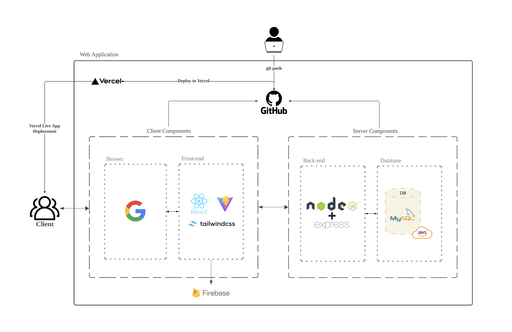

<h1 align=center> 🐶 Moongchee Server 🐶 </h1>

🐶뭉치🐶는 반려동물 용품 쇼핑과 펫시터 예약 서비스를 한 곳에서 제공하는 스마트 종합 케어 플랫폼입니다.  바쁜 반려인을 위한 편리한 반려동물 라이프를 제안합니다.

 

**Client Repo**: [Moongchee Client](https://github.com/URECA-TEAM3/moongchee-client)

<h2>목차</h2>

- [📄 개요](#-개요)
- [✏️ 프로젝트 설명](#️-프로젝트-설명)
- [👥 팀원 소개](#-팀원-소개)
- [📌 주요 서비스](#-주요-서비스)
- [⚙️ Project Architecture](#️-project-architecture)
- [🔨 Tech Stack](#-tech-stack)
- [🎯 API Endpoints](#-api-endpoints)
  - [**Auth Routes**](#auth-routes)
  - [**Member Routes**](#member-routes)
  - [**Petsitter Routes**](#petsitter-routes)
  - [**Pet Routes**](#pet-routes)
  - [**Product Routes**](#product-routes)
  - [**Payment Routes**](#payment-routes)
  - [**Cart Routes**](#cart-routes)
  - [**Notification Routes**](#notification-routes)

## 📄 개요

- 프로젝트 이름: Moongchee 🏠
- 프로젝트 개발 기간: 2024.10.21-2024.11.08
- 멤버: 팀 강서진, 김예원, 김의진, 김주영, 노승희, 박주광

## ✏️ 프로젝트 설명

**뭉치** 프로젝트는 바쁜 일상 속에서도 반려동물을 사랑하는 현대인들을 위한 스마트한 반려동물 종합 케어 플랫폼입니다. 반려동물 용품 쇼핑몰과 검증된 펫시터 예약 서비스가 결합되어, 반려인들이 필요한 모든 서비스를 한 번에 이용할 수 있도록 돕습니다. 이제 반려동물 돌봄과 쇼핑을 한 곳에서 간편하게 해결할 수 있는 뭉치와 함께, 더 편리하고 즐거운 반려동물 라이프를 만나보세요!

## 👥 팀원 소개

|  |  |  |  |  |  |
| :--------------------------------------------------------: | :-------------------------------------------------------: | :---------------------------------------------------------: | :------------------------------------------------------: | :-----------------------------------------------------------: | :------------------------------------------------------: |
|   강서진 [@skang9810](https://github.com/skang9810)    |   김예원 [@yewoniiii](https://github.com/yewoniiii)   |       김의진 [@Eu1j1n](https://github.com/Eu1j1n)       |      김주영 [@ju892](https://github.com/ju892)       |    노승희 [@seung-heee](https://github.com/seung-heee)    |    박주광 [@jugpark](https://github.com/jugpark)     |

<!-- |||||||
|강서진 [@skang9810](https://github.com/skang9810)|김예원 [@yewoniiii](https://github.com/yewoniiii)|김의진 [@Eu1j1n](https://github.com/Eu1j1n)|김주영 [@ju892](https://github.com/ju892)|노승희 [@seung-heee](https://github.com/seung-heee)|박주광 [@git](https://github.com/git)|
 -->

## 📌 주요 서비스

1. **반려동물 프로필 관리**
   - 반려동물의 이름, 나이, 견종, 성별, 중성화 여부, 사진 등을 등록 및 수정
2. **쇼핑몰 서비스**
   - 반려동물 용품을 카테고리별로 조회 및 구매
   - 장바구니 및 주문 결제 기능
   - 포인트 적립 및 사용 기능
3. **펫시터 예약 서비스**
   - 위치 기반으로 주변의 펫시터 추천 및 예약
   - 펫시터 등록, 수정, 삭제
   - 펫시터 예약 및 결제 기능
4. **알림 기능**
   - 펫시터 예약 신청, 수락, 취소 알림 제공
5. **추가기능**
   - 소셜 로그인 (Google, Kakao)
   - 간편 결제 (토스페이먼츠)

## ⚙️ Project Architecture

## 🔨 Tech Stack

- **Backend**: Node.js, Express
- **Database**: MySQL
- **Authentication**: OAuth, Social Login
- **Storage**: Firebase Storage
- **Payment Integration**: Toss Payments SDK
- **API**: Daum Postcode API (for address lookup)
- **Deployment**: Vercel & AWS

## 🎯 API Endpoints

### **Auth Routes**

- `POST /api/auth/google-login - Google OAuth 토큰을 이용해 사용자 로그인 또는 회원 가입 처리`
- `POST /api/auth/kakao-login - Kakao OAuth 토큰으로 사용자 로그인 또는 회원 가입 처리`
- `POST /api/auth/refresh-token - 리프레시 토큰을 사용하여 새로운 액세스 토큰 발급`
- `GET /api/auth/user-info - 인증된 사용자의 정보를 조회하여 반환`

### **Member Routes**

- `POST /api/members/signup - 새로운 사용자 계정을 가입하고 필요한 사용자 정보, 리프레시토큰을 저장`
- `POST /api/members/check-nickname - 사용자가 입력한 닉네임이 중복되는지 확인하고, 사용 가능 여부를 반환`
- `POST /api/members/update-points`
- `POST /api/members/send-email-verification - 회원가입 시 사용자의 이메일로 인증 코드를 전송하여 이메일 주소 검증`
- `GET /api/members/point/:id`
- `PUT /api/members/update-profile`
- `PUT /api/members/update-profile-in-cart`

### **Petsitter Routes**

- `POST /api/petsitter/apply 펫시터 지원`
- `POST /api/petsitter/reservation/list 펫시터 리스트 조회`
- `POST /api/petsitter/reservation/add 펫시터 예약 내역 추가`
- `POST /api/petsitter/reservation/confirm 펫시터 예약 확정`
- `POST /api/petsitter/reservation/cancel 펫시터 예약 취소`
- `GET /api/petsitter/list 펫시터 예약 전체 조회`
- `GET /api/petsitter/sitter/detail 펫시터 상세 조회`
- `GET /api/petsitter/reservation/detail/:id 펫시터 예약내역 상세조회`
- `PUT /api/petsitter/sitter/update 펫시터 정보 수정`

### **Pet Routes**

- `POST /api/pets/animal-register - 반려동물의 정보를 데이터베이스에 저장하여 사용자 프로필에 반려동물 정보를 추가`
- `GET /api/pets/:id 회원별 반려동물 조회`
- `GET /api/pets/detail/:id 반려동물별 정보 조회`
- `PUT /api/pets/update-profile 반려동물 정보 수정`
- `DELETE /api/pets/:id 반려동물 정보 삭제`

### **Product Routes**

- `GET /api/products 모든 상품 조회`
- `GET /api/products/:id 상품 상세 조회`
- `GET /api/products/popular-products 인기 상품 조회`
- `GET /api/products/new-products 새로운 상품 조회`
- `POST /api/products/getByIds 여러 id에 해당하는 상품 조회`

### **Payment Routes**

- `POST /api/payments 결제 정보 저장`
- `POST /api/payments/confirm 결제 정보가 올바른지 검증`
- `POST /api/payments/approve 결제 승인`
- `GET /api/payments/fail 결제 실패`

### **Cart Routes**

- `GET /api/cart/:user_id 장바구니 조회`
- `POST /api/cart 장바구니 상품 추가`
- `DELETE /api/cart/:cart_id 장바구니 상품 삭제`
- `POST /api/cart/pay 최종 결제하는 상품 전송`
- `POST /api/cart/save 장바구니 상품 정보 수정(수량, 체크상태)`
- `GET /api/cart/order/:id 주문한 상품 조회하기`
- `PUT /api/cart/refund-product 상품 주문 취소`

### **Notification Routes**

- `POST /api/notifications/save 알람 저장 및 누적`
- `GET /api/notifications/:id 회원별 알람 조회`
- `PUT /api/notifications/delete-all 전체 알람 읽음 처리`
